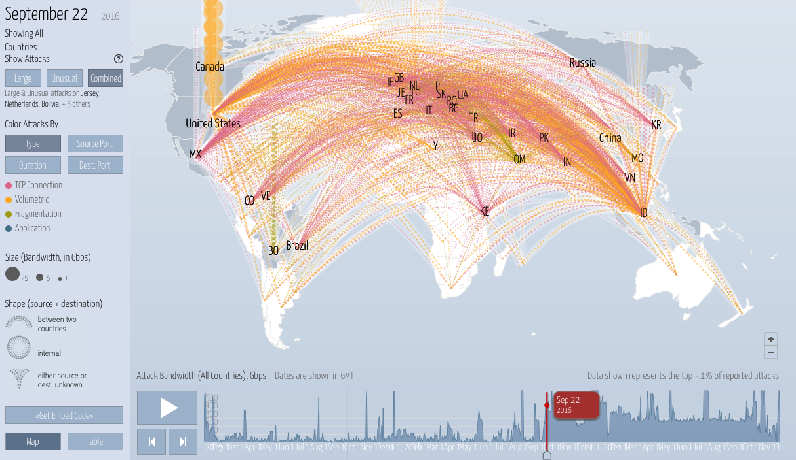
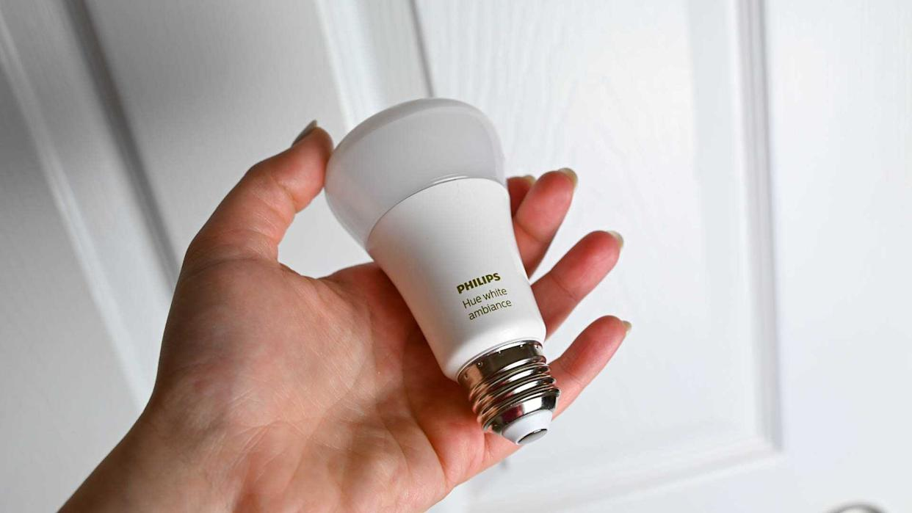

# Introduction

## Why IoT Security Matters

- IoT topology spans **hardware, networking, protocols, cloud, and OS**
- Diverse attack surface creates unique vulnerabilities
- Understanding threats helps architects design preventative measures

. . .

**Three Major IoT Attack Categories:**

1. **Mirai** - Massive DDoS via compromised IoT devices
2. **Stuxnet** - Nation-state cyber weapon targeting SCADA
3. **Chain Reaction** - PAN mesh network exploitation

---

# Mirai Botnet Attack

## Overview

- **Date:** August 2016
- **Type:** Malware infecting Linux IoT devices
- **Result:** Largest DDoS attack in history

. . .

**High-Profile Targets:**

- Krebs on Security (623 Gbps attack)
- Dyn DNS Provider
- Lonestar Cell (Liberia)

**Collateral Damage:** Amazon, GitHub, Netflix, PayPal, Reddit, Twitter

---

## Mirai Attack Methodology

### Phase 1: Scan for Victims

- Asynchronous TCP SYN scan on random IPv4 addresses
- Target ports: **SSH/Telnet (23, 2323)**
- Scan rate: ~250 bytes/sec (constrained by IoT hardware)
- Blacklisted 3.4M IPs (US Postal, HP, GE, DoD)

---

## Mirai Attack Methodology

### Phase 2: Brute Force Telnet

- Attempted login with **62 username/password pairs**
- Dictionary attack with 10 random pairs per attempt
- Successful logins reported to **C2 server**
- Later variants: Remote Code Execution (RCE) exploits

---

## Mirai Attack Methodology

### Phase 3: Infect

- Loader identifies OS and installs device-specific malware
- Kills competing processes on ports 22/23
- **Non-persistent:** Does not survive reboot
- Process name obfuscated to hide presence
- Bot stays dormant until attack command received

---

## Targeted Devices

**Device Types:**

- IP Cameras
- DVRs
- Consumer Routers
- VoIP Phones
- Printers
- Set-top Boxes

**Architectures:** 32-bit ARM, MIPS, x86

---

## Mirai Infection Timeline

| Time | Event |
|------|-------|
| Aug 1, 2016 | First scan from US hosting site |
| +120 min | First successful infection |
| +1 min | 834 devices infected |
| +20 hours | 64,500 devices infected |

. . .

**Doubling time: 75 minutes**

**Total infected: 600,000 IoT devices**

---

## Mirai Global Attack Visualization

{height=70%}

\begin{center}
\tiny Mirai DDoS Attack - September 22, 2016 (digitalattackmap.com)
\end{center}

---

## Mirai DDoS Attack Types

- **SYN Floods**
- **GRE IP Network Floods**
- **STOMP Floods**
- **DNS Floods**

. . .

**Statistics (5 months):**

- 15,194 attack commands issued
- 5,042 internet sites targeted
- Top botnet locations: Brazil (15%), Colombia (14%), Vietnam (12.5%)

---

# Stuxnet

## Overview

- **First documented nation-state cyber weapon**
- **Target:** Iranian nuclear enrichment facility (Natanz)
- **Method:** Worm targeting Siemens PLCs via SCADA
- **Damage:** 1,000+ uranium centrifuges destroyed

. . .

**Sophistication:** Used **4 zero-day exploits simultaneously**

---

## Stuxnet Attack Flow

### Phase 1: Initial Infection

- Spread via **USB drive** insertion
- Exploited Windows vulnerabilities
- Installed **rootkit** (user-mode + kernel-mode)
- Used **stolen signed driver** from Realtek
- Bypassed antivirus detection

---

## Stuxnet Attack Flow

### Phase 2: Windows Attack & Spread

- Searched for **Siemens WinCC/Step-7** SCADA software
- Connected to C2 servers for payload updates
- Targeted `s7otbdx.dll` (PLC communication library)
- Exploited **hardcoded password** (another zero-day)
- Acted as **Man-in-the-Middle** between WinCC and PLC
- Recorded normal centrifuge operation

---

## Stuxnet Attack Flow

### Phase 3: Destruction

- **Replayed pre-recorded data** to SCADA (no alarms)
- Manipulated PLCs controlling centrifuge motors
- Targeted specific frequencies: **807 Hz and 1210 Hz**

. . .

**Attack Pattern:**

- 15-50 minute damage increments
- Separated by 27 days of normal operation
- Resulted in cracked rotors and improper uranium enrichment

---

# Chain Reaction

## Overview

:::::::::::::: {.columns}
::: {.column width="60%"}

- **Type:** Academic research / proof-of-concept
- **Target:** Philips Hue smart light bulbs
- **Protocol:** Zigbee Light Link (ZLL)
- **Key insight:** No internet connection required

:::
::: {.column width="40%"}

{height=70%}

\begin{center}
\tiny Philips Hue Bulb
\end{center}

:::
::::::::::::::

. . .

**Implications:** Scalable to smart city attacks

---

## Zigbee Vulnerabilities

**Protocol Weaknesses:**

- ZLL messages **not encrypted or signed**
- Master key shared among ZLL alliance (leaked)
- Proximity check for network joining
- OTA firmware updates encrypted but breakable

---

## Chain Reaction Attack Phases

### Phase 1 & 2: Break Encryption

- Used **Correlation Power Analysis (CPA)**
- Used **Differential Power Analysis (DPA)**
- Cracked AES-CCM encryption keys
- Broke firmware signing

---

## Chain Reaction Attack Phases

### Phase 3: Bypass Proximity Check

- Found **zero-day** in Atmel AtMega bootloader
- Proximity check only valid on scan request
- Starting with different message bypasses check
- Enabled joining any Zigbee network remotely

---

## Chain Reaction Attack Phases

### Phase 4: Worm Propagation

- Infected bulb joins network using stolen master key
- Sends malicious payload to neighboring lights
- Spreads via **Percolation Theory**
- Can disable firmware update capability permanently

. . .

**Demo:** Researchers flew drone to hijack campus lights

---

# Key Security Concepts

## Definitions

| Term | Description |
|------|-------------|
| **Root of Trust** | Immutable trusted boot source (ROM) |
| **Secure Boot** | Verified signature chain from RoT to OS |
| **TEE** | Trusted Execution Environment on processor |
| **Stack Canaries** | Guards against stack overflow attacks |

---

## Cryptographic Fundamentals

- **Private Key:** Never released, stored securely, encrypts hashes
- **Public Key:** Distributed for signature verification
- **AES-CCM:** Encryption standard for Zigbee (IEEE 802.15.4)

---

# Lessons Learned

## Prevention Strategies

1. **Change default credentials** on all IoT devices
2. **Disable unnecessary ports** (Telnet, SSH)
3. **Implement secure boot** with verified signatures
4. **Regular firmware updates** with signed packages
5. **Network segmentation** for IoT devices
6. **Monitor for anomalous traffic** patterns

---

## Summary

| Attack | Vector | Impact |
|--------|--------|--------|
| **Mirai** | Default passwords, Telnet | 623 Gbps DDoS |
| **Stuxnet** | USB, Zero-days, SCADA | Physical destruction |
| **Chain Reaction** | Zigbee, Power analysis | Mesh takeover |

. . .

**Key Takeaway:** IoT security requires defense-in-depth across all layers

---

# Thank You

## Questions?

**Shree Kottes J**

Roll No: 7176 22 31 050

Course: Smart Sensors and IoT (20MSS25)

