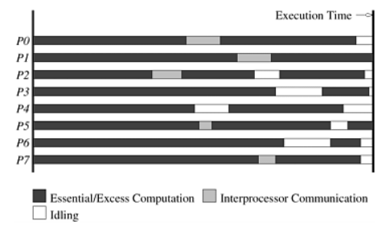

# Analytical Modeling of Parallel Programs

- A **sequential algorithm** is evaluated by execution time as a function of input size
- A **parallel algorithm** depends on:
  - Input size
  - Number of processing elements
  - Computation and communication speeds
- A **parallel system** = algorithm + parallel architecture

---

# Why Simple Metrics Fall Short

- Wall-clock time alone cannot be extrapolated to:
  - Larger problem instances
  - Different machine configurations
- Speedup metrics have pitfalls:
  - A poorer serial algorithm may be more parallelizable
- More complex metrics are needed for accurate performance evaluation

---

# Sources of Overhead in Parallel Programs

Using 2× hardware rarely gives 2× speedup due to:

1. **Interprocess Communication**
2. **Idling**
3. **Excess Computation**

---

# Execution Profile of a Parallel Program

{ height=65% }

Execution profile of 8 PEs showing computation, communication, and idle time distribution.

---

# Overhead: Interprocess Communication

- Processing elements must interact and share intermediate results
- Communication time is typically the **most significant** source of overhead
- Unavoidable in any nontrivial parallel system

---

# Overhead: Idling

Processing elements become idle due to:

- **Load imbalance** — unequal subtask sizes
- **Synchronization** — waiting for all PEs to reach a barrier
- **Serial components** — only one PE can work; others must wait

---

# Overhead: Excess Computation

- The fastest sequential algorithm may not be parallelizable
- A parallel algorithm may be based on a **less optimal but more concurrent** sequential algorithm
- Even with the best serial base, some computations are **repeated** across PEs (e.g., FFT)

---

# Summary

| Overhead Source            | Cause                                       |
|----------------------------|---------------------------------------------|
| Interprocess Communication | Data sharing between PEs                    |
| Idling                     | Imbalance, synchronization, serial sections |
| Excess Computation         | Suboptimal or redundant parallel work       |

Quantifying these overheads is essential to establish a **figure of merit** for parallel algorithms.
